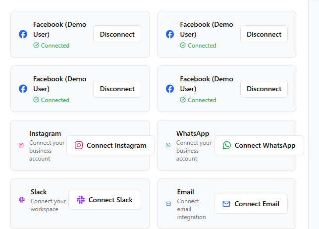

# Dana AI Platform



A powerful AI-powered customer support and communication management platform that integrates multiple messaging channels, email, and business tools into a unified interface. The platform uses artificial intelligence to enhance customer communications, analyze sentiment, and provide data-driven insights.

## Table of Contents

- [Features](#features)
- [Technology Stack](#technology-stack)
- [Project Structure](#project-structure)
- [Setup and Installation](#setup-and-installation)
- [Authentication](#authentication)
- [Frontend Components](#frontend-components)
- [Backend Architecture](#backend-architecture)
- [API Endpoints](#api-endpoints)
- [Platform Integrations](#platform-integrations)
- [AI Capabilities](#ai-capabilities)
- [Knowledge Base](#knowledge-base)
- [Analytics](#analytics)
- [File Export](#file-export)

## Features

- **Unified Communication Hub**: Manage conversations from multiple platforms in one place
- **AI-Powered Responses**: Generate intelligent responses to customer inquiries
- **Knowledge Base Management**: Upload and manage documents to enhance AI responses
- **Real-time Analytics**: Track performance metrics and conversation analytics
- **Platform Integrations**: Connect with Facebook, Instagram, Slack, WhatsApp, and email
- **Sentiment Analysis**: Evaluate customer sentiment across all communications
- **Searchable History**: Find content across conversations and knowledge base
- **PDF Export**: Generate comprehensive reports for sharing and analysis
- **Team Management**: Collaborate with team members on customer inquiries

## Technology Stack

### Frontend
- React with TypeScript
- TanStack Query (React Query) for data fetching
- Tailwind CSS with Shadcn UI components
- Chart.js and Recharts for data visualization
- Wouter for routing
- React Hook Form for form handling

### Backend
- Node.js with Express
- TypeScript
- PostgreSQL database
- Drizzle ORM with Zod validation
- OpenAI GPT-4o API integration
- File parsing for PDF, DOCX, and TXT
- Replit Auth (OpenID Connect)

### External Services
- Slack API for messaging integration
- Facebook/Instagram Graph API for social media
- SendGrid for email communication
- OpenAI API for AI capabilities

## Project Structure

The project follows a client-server architecture:

```
/
├── client/             # Frontend React application
│   ├── src/
│   │   ├── components/ # UI components
│   │   ├── hooks/      # Custom React hooks
│   │   ├── lib/        # Utility functions
│   │   ├── pages/      # Application pages
│   │   └── main.tsx    # Application entry point
├── server/             # Backend Express server
│   ├── platforms/      # Platform-specific integrations
│   ├── storage.ts      # Database operations
│   ├── routes.ts       # API route definitions
│   └── index.ts        # Server entry point
├── shared/             # Shared code between client and server
│   └── schema.ts       # Database schema and types
└── uploads/            # Uploaded files storage
```

## Setup and Installation

The project is configured to run on Replit, with automated workflows for development.

### Environment Variables

The following environment variables are required:

- `DATABASE_URL`: PostgreSQL database connection string
- `SESSION_SECRET`: Secret for session management
- `SLACK_BOT_TOKEN`: Token for Slack integration
- `SLACK_CHANNEL_ID`: Channel ID for Slack notifications
- `FACEBOOK_APP_ID`: Facebook app ID for authentication
- `FACEBOOK_APP_SECRET`: Facebook app secret for authentication
- `OPENAI_API_KEY`: OpenAI API key for AI capabilities

### Development

To start the development server:

```bash
npm run dev
```

This starts both the backend Express server and the frontend Vite development server.

## Authentication

The application uses Replit's built-in authentication system through OpenID Connect. Authentication flow is managed through the following endpoints:

- `/api/login`: Initiates the login flow
- `/api/callback`: Processes the OAuth callback
- `/api/logout`: Logs out the user

User sessions are stored in the PostgreSQL database for persistence.

## Frontend Components

### Pages

- **Dashboard**: Main overview with key metrics and recent activities
- **Conversations**: List of all customer conversations across platforms
- **AI Responses**: AI-generated responses awaiting approval
- **Knowledge Base**: Document management for AI training
- **Analytics**: Detailed performance metrics and charts
- **Search**: Cross-platform search functionality
- **Settings**: User and application settings

### Core Components

- **Header**: Navigation and user profile management
- **PlatformConnectors**: UI for connecting various platforms
- **ConversationList**: Displays active conversations
- **MessageThread**: Shows individual message exchanges
- **AIResponseCard**: Displays AI-generated responses
- **KnowledgeBaseUploader**: Handles document uploads
- **AnalyticsCharts**: Various data visualization components
- **PDFExporter**: Exports data to PDF format

## Backend Architecture

### Database Schema

The application uses a PostgreSQL database with the following core tables:

- `users`: User information and authentication details
- `sessions`: User session data
- `platforms`: Connected platform credentials and metadata
- `conversations`: Customer conversations
- `messages`: Individual messages within conversations
- `knowledge_base`: Uploaded documents and extracted content
- `analytics`: Performance metrics and statistics

### Storage Layer

Data operations are abstracted through the `IStorage` interface, implemented by:
- `MemStorage`: In-memory storage for development
- `DatabaseStorage`: PostgreSQL database storage for production

## API Endpoints

### Authentication
- `GET /api/auth/user`: Get current user information
- `GET /api/login`: Initiate authentication flow
- `GET /api/callback`: Process authentication callback
- `GET /api/logout`: Log out the current user

### Platforms
- `GET /api/platforms`: List all connected platforms
- `POST /api/platforms`: Add a new platform connection
- `DELETE /api/platforms/:id`: Remove a platform connection

### Conversations
- `GET /api/conversations`: List all conversations
- `GET /api/conversations/:id`: Get a specific conversation
- `POST /api/conversations`: Create a new conversation
- `GET /api/conversations/:id/messages`: Get messages for a conversation
- `POST /api/conversations/:id/messages`: Add a message to a conversation

### Knowledge Base
- `GET /api/knowledge-base`: List all knowledge base items
- `POST /api/knowledge-base`: Upload a new document
- `DELETE /api/knowledge-base/:id`: Remove a document

### Analytics
- `GET /api/analytics`: Get analytics data
- `GET /api/analytics/platform-performance`: Get platform performance metrics
- `GET /api/analytics/conversation-metrics`: Get conversation statistics

## Platform Integrations

### Slack
- Implementation in `server/platforms/slack.ts`
- Features:
  - Channel monitoring
  - Message retrieval
  - Message sending
  - Notification forwarding

### Facebook/Instagram
- Implementation in `server/platforms/facebook.ts` and `server/platforms/instagram.ts`
- Features:
  - OAuth authentication
  - Page/account connections
  - Message retrieval
  - Message sending

### WhatsApp
- Implementation in `server/platforms/whatsapp.ts`
- Features:
  - Business account integration
  - Message retrieval
  - Message sending
  - Media handling

### Email
- Implementation in `server/platforms/email.ts`
- Features:
  - SMTP integration
  - Email retrieval
  - Email sending
  - Template management

## AI Capabilities

The platform leverages OpenAI's GPT-4o model for various AI features:

### Response Generation
- Generates contextually relevant responses to customer inquiries
- Uses conversation history and knowledge base for context
- Maintains consistent tone and style

### Sentiment Analysis
- Analyzes customer message sentiment
- Provides sentiment scores for analytics
- Helps identify potentially negative interactions

### Content Extraction
- Extracts relevant information from uploaded documents
- Creates searchable content for the knowledge base
- Enables AI to reference company-specific information

## Knowledge Base

The knowledge base functionality allows you to upload documents that enhance the AI's ability to provide accurate and company-specific information:

### Supported File Types
- PDF documents
- Word documents (DOCX)
- Plain text files (TXT)

### File Processing
1. Files are uploaded to the server
2. Content is extracted using appropriate parsers
3. Text is processed and stored in the database
4. Content becomes available for AI reference

### Search Capabilities
- Full-text search across all documents
- Context-aware referencing by the AI
- Document metadata tracking

## Analytics

The analytics system provides insights into platform performance:

### Metrics Tracked
- Total messages processed
- AI response rate
- Manual response rate
- Average response time
- Customer sentiment score
- Platform-specific performance

### Visualization
- Time-series charts for trend analysis
- Platform comparison metrics
- Conversation volume tracking
- AI efficiency metrics

## File Export

The platform supports exporting data to PDF format for reporting:

### Export Capabilities
- Analytics reports with charts and data tables
- Conversation transcripts
- Knowledge base document listings
- Custom date range selection

### PDF Generation
- Uses jsPDF for document creation
- Includes charts and visualizations
- Supports company branding
- Generates printer-friendly layouts

## License

This project is proprietary and confidential. Unauthorized copying, transfer, or reproduction of the contents of this software is strictly prohibited.