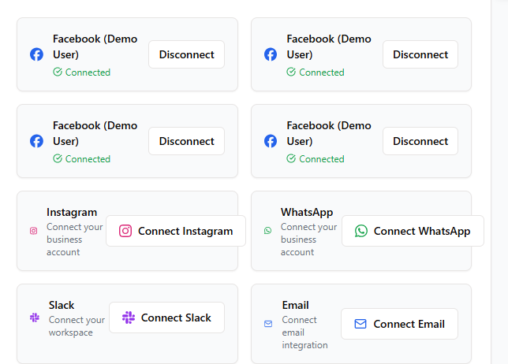

# Multi-Tenant Features: User Guide

## What is Multi-Tenancy?

The Dana AI Platform uses multi-tenancy to allow you to manage multiple organizations from a single account. This means you can:

- Belong to multiple organizations
- Switch between organizations easily
- Keep data completely separate between organizations

## Organization Switching

### How to Switch Organizations

1. Look for the organization selector in the top navigation bar
2. Click on the current organization name/logo
3. Select a different organization from the dropdown
4. The system will automatically refresh data for the new organization

### What Happens When You Switch

When you switch organizations:

- All visible data changes to show only the selected organization's information
- Platforms, conversations, and knowledge base will update
- Analytics will show metrics specific to the selected organization
- Any actions you take will affect only the current organization

## Managing Multiple Organizations

### Viewing Your Organizations

To see all organizations you're a member of:
- Click on your profile icon
- Select "Organizations" from the dropdown menu
- View all organizations and your role in each

### Creating a New Organization

To create a new organization:
1. Go to your profile menu
2. Select "Organizations"
3. Click "Create New Organization"
4. Fill in organization details and submit

### Joining an Existing Organization

To join an existing organization:
1. Ask an administrator from that organization to send you an invitation
2. Check your email for the invitation link
3. Click the link and follow the instructions to join

## Data Isolation and Security

The Dana AI Platform ensures complete data isolation between organizations:

- **Conversations**: Messages from one organization are never visible to another
- **Platforms**: Each organization has its own set of connected social media platforms
- **Knowledge Base**: Documents and information are strictly separated
- **Team Members**: User roles and permissions are organization-specific
- **Analytics**: Each organization has its own analytics dashboard

## Best Practices

1. **Always verify the organization context**: Check which organization is currently selected before making important changes
2. **Set a default organization**: The organization you use most frequently should be your default
3. **Use consistent naming**: Develop naming conventions for similar items across organizations
4. **Separate browser profiles**: For maximum security when managing sensitive organizations, consider using separate browser profiles

## Troubleshooting

### I can't see my data after switching organizations

Make sure you:
- Have proper permissions in the organization
- Have been fully onboarded to the organization
- Are looking for data that exists in that organization (data is not shared between organizations)

### I accidentally created something in the wrong organization

1. Switch to the correct organization
2. Re-create the item in the correct organization
3. Switch back to the incorrect organization and delete the mistaken item

## Need More Help?

Contact support at support@dana-ai.com or reach out to your account manager for personalized assistance with multi-tenant features.